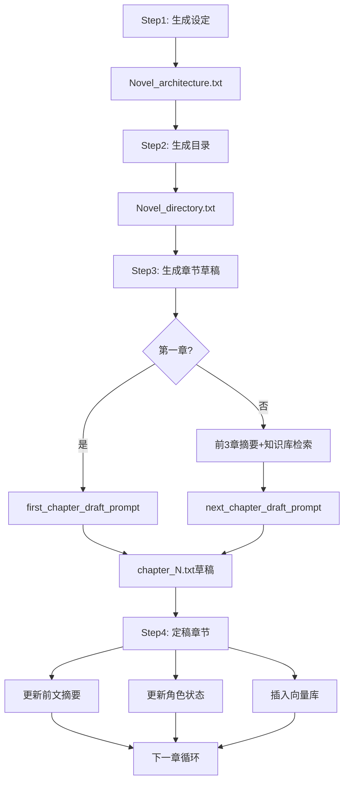

---

## 📊 项目架构总览

这是一个**基于大语言模型的AI小说自动生成系统**,采用模块化设计,核心功能包括小说架构生成、章节蓝图规划、智能章节写作、一致性检查和知识库集成。

---

## 🏗️ 核心模块结构

### **1. 入口与配置层**

#### `main.py` - 应用入口
- 功能: 启动GUI应用
- 依赖: `ui` 模块和 `customtkinter` 库

#### `config_manager.py` - 配置管理器
**核心功能:**
- 配置文件读写 (`load_config`, `save_config`)
- LLM连接测试 (`test_llm_config`)
- Embedding模型测试 (`test_embedding_config`)

**管理的配置项:**
```json
{
  "api_key": "LLM API密钥",
  "base_url": "API终端地址",
  "interface_format": "接口类型(OpenAI/Gemini/Azure等)",
  "model_name": "模型名称",
  "temperature": "创意度参数(0-1)",
  "max_tokens": "最大回复长度",
  "embedding_*": "向量化模型相关配置",
  "topic/genre/num_chapters": "小说参数"
}
```

---

### **2. LLM适配层**

#### `llm_adapters.py` - 大语言模型接口适配器
**架构模式:** 适配器模式 + 工厂模式

**支持的模型接口:**
| 适配器类 | 支持平台 | 特殊处理 |
|---------|---------|---------|
| `OpenAIAdapter` | OpenAI/兼容接口 | 自动处理`/v1`后缀 |
| `DeepSeekAdapter` | DeepSeek | 同OpenAI格式 |
| `GeminiAdapter` | Google Gemini | 使用`genai.Client` |
| `AzureOpenAIAdapter` | Azure OpenAI | URL解析提取endpoint/deployment |
| `AzureAIAdapter` | Azure AI Inference | 特殊消息格式 |
| `OllamaAdapter` | Ollama本地服务 | 默认API key处理 |
| `MLStudioAdapter` | LM Studio | 兼容OpenAI格式 |
| `VolcanoEngineAIAdapter` | 火山引擎 | 超时配置优化 |
| `SiliconFlowAdapter` | 硅基流动 | 国内服务优化 |
| `GrokAdapter` | xAI Grok | 特殊系统提示词 |

**关键函数:**
- `check_base_url()`: 智能处理URL格式(#结尾跳过/v1追加)
- `create_llm_adapter()`: 工厂函数,根据`interface_format`返回对应适配器

#### `embedding_adapters.py` - 向量化模型适配器
**支持的Embedding接口:**
- `OpenAIEmbeddingAdapter`: OpenAI/兼容接口
- `AzureOpenAIEmbeddingAdapter`: Azure OpenAI
- `OllamaEmbeddingAdapter`: 本地Ollama (`/api/embeddings`路径)
- `MLStudioEmbeddingAdapter`: LM Studio
- `GeminiEmbeddingAdapter`: Google Gemini (`embedContent`接口)
- `VolcanoEngineEmbeddingAdapter`: 火山引擎(使用官方SDK)
- `SiliconFlowEmbeddingAdapter`: 硅基流动

**核心方法:**
- `embed_documents(texts)`: 批量文本向量化
- `embed_query(query)`: 单个查询向量化
- `ensure_openai_base_url_has_v1()`: URL格式标准化

---

### **3. 提示词系统**

#### `prompt_definitions.py` - 提示词模板库
**基于雪花写作法 + 角色弧光理论 + 悬念三要素模型**

**提示词分类:**

**① 架构生成提示词**
```python
core_seed_prompt              # 核心种子(单句故事公式)
character_dynamics_prompt     # 角色动力学(三角驱动力+弧线)
world_building_prompt         # 世界观矩阵(物理/社会/隐喻三维)
plot_architecture_prompt      # 三幕式情节架构
```

**② 章节规划提示词**
```python
chapter_blueprint_prompt       # 章节蓝图生成
chunked_chapter_blueprint_prompt  # 分块章节蓝图生成
```

**③ 写作执行提示词**
```python
first_chapter_draft_prompt     # 第一章草稿
next_chapter_draft_prompt      # 后续章节草稿(含前文摘要/知识库)
```

**④ 维护更新提示词**
```python
summary_prompt                 # 前文摘要更新
create_character_state_prompt  # 初始角色状态生成
update_character_state_prompt  # 角色状态更新
summarize_recent_chapters_prompt  # 当前章节摘要生成
```

**⑤ 知识库提示词**
```python
knowledge_search_prompt        # 生成检索关键词
knowledge_filter_prompt        # 知识内容过滤
```

**⑥ 角色导入提示词**
```python
Character_Import_Prompt        # 从文本提取角色信息
```

---

### **4. 小说生成核心引擎 (`novel_generator/`目录)**

#### `common.py` - 通用工具模块
**核心功能:**
- `call_with_retry()`: 重试机制封装(最大3次,间隔2秒)
- `remove_think_tags()`: 清理LLM思考标签
- `invoke_with_cleaning()`: LLM调用+结果清理
- `debug_log()`: 提示词和响应日志记录

#### `architecture.py` - 小说架构生成器
**核心函数:** `Novel_architecture_generate()`

**生成流程(4步断点续传):**
```
Step1: 核心种子生成 → core_seed_result
Step2: 角色动力学 → character_dynamics_result + character_state.txt
Step3: 世界观构建 → world_building_result  
Step4: 三幕式情节 → plot_arch_result
↓
输出: Novel_architecture.txt + partial_architecture.json(中间状态)
```

**容错机制:**
- 每步完成后保存`partial_architecture.json`
- 下次调用自动从断点继续
- 全部完成后删除中间文件

#### `blueprint.py` - 章节蓝图生成器
**核心函数:** `Chapter_blueprint_generate()`

**智能分块策略:**
```python
chunk_size = (floor(max_tokens/100/10)*10) - 10
# 示例: max_tokens=4096 → chunk_size=30章
```

**生成模式:**
- **一次性生成:** 章节数 ≤ chunk_size
- **分块生成:** 超过chunk_size,自动分批生成
- **断点续传:** 检测已有章节,从下一章继续

**输出格式:**
```
第n章 - [标题]
本章定位: [角色/事件/主题]
核心作用: [推进/转折/揭示]
悬念密度: [紧凑/渐进/爆发]
伏笔操作: 埋设(A)→强化(B)
认知颠覆: ★★☆☆☆
本章简述: [一句话概括]
```

#### `chapter.py` - 章节草稿生成器
**核心函数:** 
- `generate_chapter_draft()`: 章节生成总入口
- `build_chapter_prompt()`: 构建章节提示词

**章节生成流程:**
```
1. 读取基础文件(架构/目录/前文摘要/角色状态)
2. 解析当前+下一章节信息
3. 获取前3章文本 → 生成当前章节摘要
4. 知识库检索:
   ├── 生成检索关键词(knowledge_search_prompt)
   ├── 向量检索(支持多组关键词)
   ├── 应用内容规则(apply_content_rules)
   └── 知识过滤(knowledge_filter_prompt)
5. 组装最终提示词
6. 调用LLM生成 → 保存chapter_N.txt
```

**知识库应用规则:**
```python
# 内容重复检测
if 时间距离 <= 2章: 跳过
elif 3-5章: 需修改≥40%
else: 可引用核心

# 内容分级
[TECHNIQUE] → 写作技法(优先60%)
[SETTING] → 设定资料(选择性)
[GENERAL] → 通用参考
```

**重要辅助函数:**
- `get_last_n_chapters_text()`: 获取前N章文本
- `summarize_recent_chapters()`: 生成当前章节摘要(带下一章预告)
- `parse_search_keywords()`: 解析检索关键词(`·`分隔)
- `apply_content_rules()`: 近章去重规则
- `get_filtered_knowledge_context()`: 知识库过滤

#### `finalization.py` - 章节定稿处理器
**核心函数:**
- `finalize_chapter()`: 定稿流程总控
- `enrich_chapter_text()`: 章节扩写(可选)

**定稿流程:**
```
1. 读取chapter_N.txt
2. 更新前文摘要(summary_prompt)
3. 更新角色状态(update_character_state_prompt)
4. 插入向量库(update_vector_store)
5. 保存所有更新
```

#### `knowledge.py` - 知识库导入器
**核心函数:**
- `import_knowledge_file()`: 导入外部知识文件
- `advanced_split_content()`: 智能文本分段

**分段策略:**
```python
# 基于NLTK的句子分割
1. sent_tokenize分句
2. 按max_length=500字聚合
3. 避免句子截断
```

**支持场景:**
- 第三方写作教程
- 世界观设定文档
- 参考资料导入

#### `vectorstore_utils.py` - 向量库管理器
**基于ChromaDB + LangChain**

**核心函数:**
| 函数 | 功能 | 容错策略 |
|-----|------|---------|
| `init_vector_store()` | 初始化向量库 | 失败返回None不中断 |
| `load_vector_store()` | 加载已有向量库 | 不存在返回None |
| `update_vector_store()` | 插入新章节 | 自动初始化/追加 |
| `get_relevant_context_from_vector_store()` | 相似度检索 | 失败返回空字符串 |
| `clear_vector_store()` | 清空向量库 | 删除vectorstore目录 |
| `split_text_for_vectorstore()` | 文本分段 | 基于NLTK+长度控制 |

**向量库结构:**
```
filepath/
└── vectorstore/
    └── chroma_collection/
        ├── 章节文本向量
        └── 知识库文本向量
```

---

### **5. 辅助工具模块**

#### `utils.py` - 文件操作工具
**核心函数:**
- `read_file()`: 安全读取文件(异常返回空)
- `save_string_to_txt()`: 覆盖写入
- `append_text_to_file()`: 追加写入
- `clear_file_content()`: 清空文件
- `save_data_to_json()`: JSON保存

#### `consistency_checker.py` - 一致性检查器
**核心函数:** `check_consistency()`

**检查维度:**
```
1. 小说设定 vs 最新章节
2. 角色状态一致性
3. 前文摘要衔接
4. 未解决冲突追踪(plot_arcs)
```

**输出:** 冲突报告或"无明显冲突"

#### `chapter_directory_parser.py` - 目录解析器
**核心函数:**
- `parse_chapter_blueprint()`: 解析完整蓝图
- `get_chapter_info_from_blueprint()`: 获取指定章节信息

**解析字段:**
```python
{
  "chapter_number": int,
  "chapter_title": str,
  "chapter_role": str,
  "chapter_purpose": str,
  "suspense_level": str,
  "foreshadowing": str,
  "plot_twist_level": str,
  "chapter_summary": str
}
```

#### `tooltips.py` - UI提示文本
(此文件内容未读取,推测为UI层使用的提示信息定义)

---

## 🔄 完整工作流程



---

## 📦 数据文件结构

```
filepath/
├── Novel_architecture.txt          # 小说总体架构
├── Novel_directory.txt             # 章节蓝图目录
├── partial_architecture.json       # 架构生成中间状态(可选)
├── global_summary.txt              # 前文摘要
├── character_state.txt             # 角色状态追踪
├── plot_arcs.txt                   # 未解决冲突记录
├── chapters/
│   ├── chapter_1.txt
│   ├── chapter_2.txt
│   └── ...
└── vectorstore/                    # ChromaDB向量库
    └── novel_collection/
```

---

## 🎯 核心技术特点

### **1. 容错机制**
- **断点续传:** 架构生成/章节蓝图支持中断恢复
- **重试策略:** LLM/Embedding调用失败自动重试3次
- **降级处理:** 向量库失败不阻断主流程

### **2. 长文本处理**
- **分块生成:** 章节蓝图智能分块(基于max_tokens)
- **上下文限制:** 
  - 前3章文本截取最大4000字
  - 前章结尾仅保留800字
  - 检索结果限制2000字

### **3. 知识库增强**
- **多层级检索:** 生成关键词 → 向量检索 → 内容过滤
- **重复检测:** 时间距离判断+相似度阈值
- **内容分级:** 写作技法>设定资料>历史章节

### **4. 提示词工程**
- **结构化输出:** 严格定义格式标记
- **上下文注入:** 当前章+下一章信息预告
- **规则嵌入:** 在提示词中内置写作规则

---

## 🔧 依赖库清单

**核心依赖:**
- `langchain` / `langchain-core` / `langchain-openai` / `langchain-community` / `langchain_chroma`: LLM框架
- `chromadb`: 向量数据库
- `openai` / `google-generativeai` / `azure-ai-inference`: 各平台SDK
- `sentence-transformers`: 本地向量化模型
- `nltk`: 自然语言处理(文本分割)
- `requests`: HTTP请求
- `customtkinter`: 现代化UI库

**辅助工具:**
- `keybert`: 关键词提取(知识库模块)
- `scikit-learn`: 余弦相似度计算

---

## 💡 架构设计亮点

1. **适配器模式:** 统一10+种LLM/Embedding接口
2. **工厂模式:** `create_llm_adapter()`动态实例化
3. **策略模式:** 不同章节使用不同提示词策略
4. **观察者模式:** 定稿时同步更新多个状态文件
5. **模板方法:** `invoke_with_cleaning()`标准化调用流程

---

## 🚀 扩展性设计

**新增LLM平台仅需3步:**
```python
# 1. 创建适配器类
class NewPlatformAdapter(BaseLLMAdapter):
    def invoke(self, prompt: str) -> str:
        # 实现调用逻辑
        
# 2. 在create_llm_adapter()添加分支
elif fmt == "new_platform":
    return NewPlatformAdapter(...)
    
# 3. UI层添加选项
```

---

这个项目采用**高内聚、低耦合**的模块化设计,通过适配器层解耦LLM平台差异,通过提示词系统解耦写作逻辑,通过向量库实现长程记忆,是一个工程化程度较高的AI辅助写作系统。主要技术栈为Python + LangChain + ChromaDB + CustomTkinter。